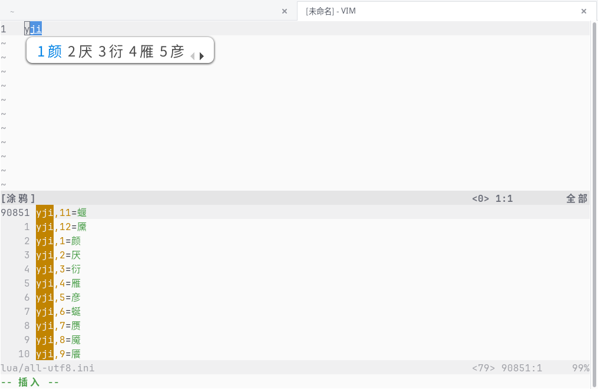
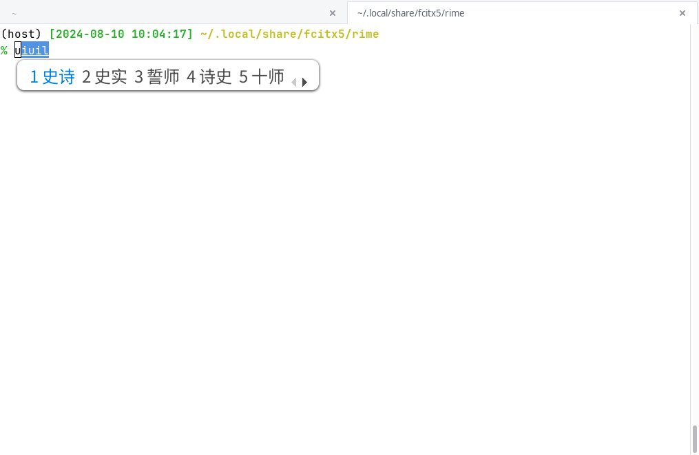

# rime-config

## 本仓库包含如下内容

### [lua/aux_code.lua](lua/aux_code.lua)
- 实现了 **自定义短语** 功能, 用于以挂接辅助码的方式来支持编码方案 (例如小鹤音形, 五笔等);



- 实现了 **直接辅助码** 功能, 将 "自定义短语" 中的编码第三位作为辅助码来筛选词语;
    - 在输入编码为 5 / 7 / 9 时生效, 对应二字词 / 三字词 / 四字词 (更长的输入就没有必要了);
    - 为了实现的简单, 辅助码仅支持 1 位;
    - 辅助码支持词中任意字;



- 由于版权因素, 本仓库并不提供 "自定义短语" 文件.

### [double_pinyin_flypy.custom.yaml](double_pinyin_flypy.custom.yaml)
- 个人配置, 其中包含了上述 lua 插件的使用说明;

也引用如下:

```yaml
  # 需要放在 simplifier filter 之后
  engine/filters/@after 0: lua_filter@*aux_code@all-utf8.ini
  #aux_code/phrase: false  # 取消注释来禁用自定义短语加入候选
  #aux_code/filter: false  # 取消注释来禁用辅助码筛词
```

### [default.custom.yaml](default.custom.yaml)
- 个人配置.

## 本仓库未包含的文件

### double_pinyin_flypy.schema.yaml
- 来自 <https://github.com/rime/rime-double-pinyin> 仓库;

### lua/all-utf8.ini
- `编码,序号=字词` 格式的 "自定义短语" (不满足这个格式的行会被忽略);
- 当然, 你可以将其改成其他文件名; 只要在方案中引用此插件时进行对应修改即可.

## 致谢

- <https://github.com/HowcanoeWang/rime-lua-aux-code> RIME输入法辅助码音形分离插件; 本仓库的 lua 代码改动自此.
